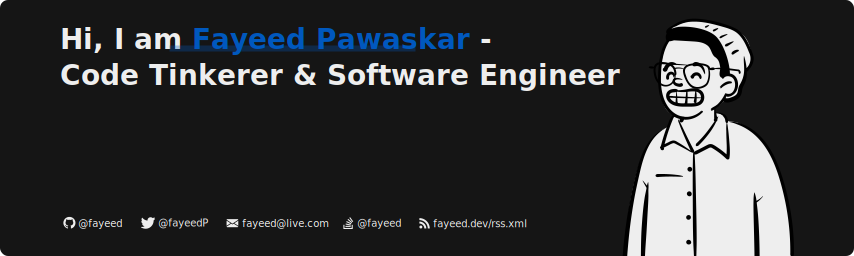

  

 

> *Full-stack engineer from Mumbai. 10+ years shipping software. 835+ GitHub stars. Currently open to new opportunities.*

---

### 👋 Hey, I'm Fayeed

I love tinkering at the intersection of **systems programming**, **developer tooling**, and **the decentralized web**. I've built Flutter packages used by thousands, contributed to decentralized social frameworks, and shipped AI-powered products. The borrow checker and I have a complicated but loving relationship.

- 🦀 Writing Rust whenever I get the chance
- 🌐 Previously at [Coasys](https://coasys.org) building a decentralized social layer (ADAM)
- 🤖 Most recently at [Presence.ai](https://presence.ai) building AI-powered communication tools
- 📦 835+ stars across open source packages
- 📝 I write about things I learn at [fayeed.dev](https://fayeed.dev)
- 💼 Open to full-time and contract roles
- 💌 [fayeed52@gmail.com](mailto:fayeed52@gmail.com)

---

### 🛠 Tech Stack

---

### ✍️ Latest Posts

- [**Building next-agent-md — Markdown for AI Agents in Next.js**](https://fayeed.dev/blog/next-agent-md) — Cut AI agent token usage by ~80% *(Feb 2025)*
- [**Using HTML in SVG (Wait, What?)**](https://fayeed.dev/blog/html-in-svg) *(Aug 2020)*
- [**Generating a sitemap for your static Next.js website**](https://fayeed.dev/blog/nextjs-sitemap) *(Aug 2020)*
- [**Building my personal website using Next.js SSG**](https://fayeed.dev/blog/personal-website-nextjs) *(Aug 2020)*

---

### 🔗 Find me around the web

